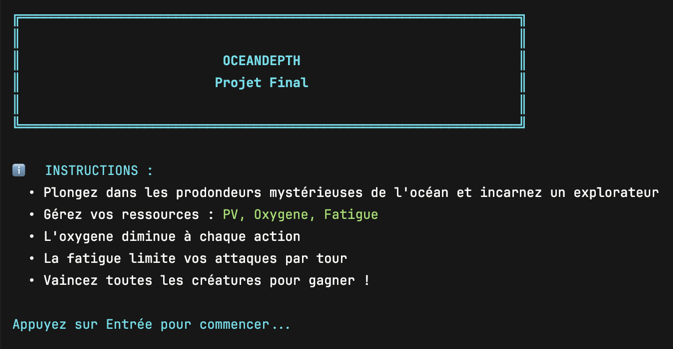
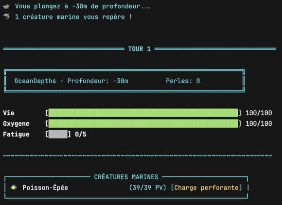
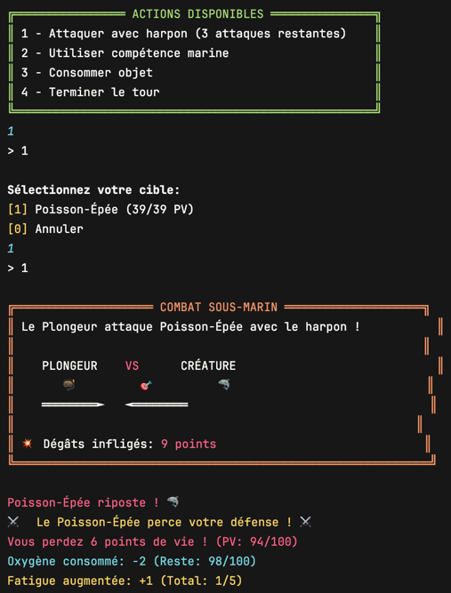
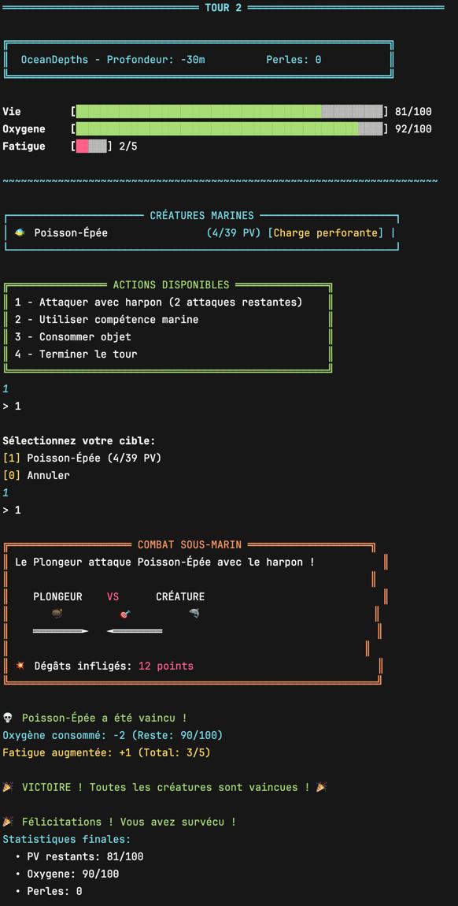

# Progression OceanDepth

## Étapes réalisées
- [X] Étape 1 : Génération des créatures.
- [X] Étape 2 : Attaque joueur.
- [X] Étape 3 : Attaque créatures.

## Captures d'écran

## Difficultés rencontrées

Mauvaise organisation en début de projet : répartition des tâches, annotations et suivi insuffisants, mais une nette amélioration a été observée au fil du développement.